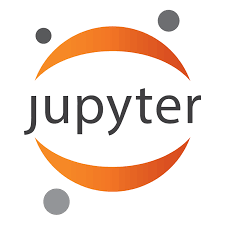

# Pangeo Tutorial for 2018 UCAR SEA Conference

Pangeo                     |  Xarray | Dask | Jupyter
:-------------------------:|:-------------------------:|:-------------------------:|:-------------------------:
  |   |  | 

This repository contains materials for the Pangeo Tutorial [Atmospheric data analysis with Dask and Xarray](https://sea.ucar.edu/event/atmospheric-data-analysis-dask-and-xarray) that will be presented at the 2018 UCAR Software Engineering Assembly.

## Front Matter

- **[About Pangeo](https://pangeo-data.github.io/):** Pangeo is a community effort for big data in the geosciences using Python. A key component of the Pangeo effort is the improved integration of [Xarray](http://xarray.pydata.org/en/latest/index.html) and [Dask](http://dask.pydata.org/en/latest/index.html) to enamble analysis of very large datasets.
- **[About Xarray](http://xarray.pydata.org/en/latest/index.html):** xarray is an open source project and Python package that aims to bring the labeled data power of pandas to the physical sciences, by providing N-dimensional variants of the core pandas data structures.
- **[About Dask](http://dask.pydata.org/en/latest/index.html):** Dask is a flexible parallel computing library for analytic computing.
- **[About Jupyter](http://jupyter.org/):** Project Jupyter exists to develop open-source software, open-standards, and services for interactive computing across dozens of programming languages. The Jupyter Notebook is an open-source web application that allows you to create and share documents that contain live code, equations, visualizations and narrative text. Uses include: data cleaning and transformation, numerical simulation, statistical modeling, data visualization, machine learning, and much more.

## Setup

This tutorial is designed to run on the [Cheyenne High-Performance Computer](https://www2.cisl.ucar.edu/resources/computational-systems/cheyenne), [Pangeo's JupyterHub deployed on Google Compute Platform](http://pangeo.pydata.org/), or on a local computer (see *Running Locally* below). The larger sample datasets are only be available on GCP and Cheyenne but smaller versions of the same datasets can be downloaded from this link ([TODO]) when running locally.

For detailed setup instructions, see [setup.md](./setup.md).

### Running Locally

```
git clone https://github.com/pangeo-data/pangeo-tutorial-sea-2018.git
cd pangeo-tutorial-sea-2018
conda env create -f environment.yml -n pangeo
source activate pangeo
```

Then start a JupyterLab server:

```
jupyter lab
```

## Acknowledgements

At its core, Pangeo is a community effort built around open-source software. As such, the credit for the developments of the software described here belongs with the community that created it. Ryan Abernathey and Matt Rocklin provided resources and input specific to this tutorial.

Pangeo is [supported](https://www.nsf.gov/awardsearch/showAward?AWD_ID=1740633&HistoricalAwards=false) by the [National Science Foundation (NSF)](https://www.nsf.gov/) and the [EarthCube Program](https://www.earthcube.org/). NCAR is separately supported by the [National Science Foundation (NSF)](https://www.nsf.gov/).

Google provided compute credits on [Google Compute Engine](https://cloud.google.com/), which are used to back the Pangeo GCP deployment.
